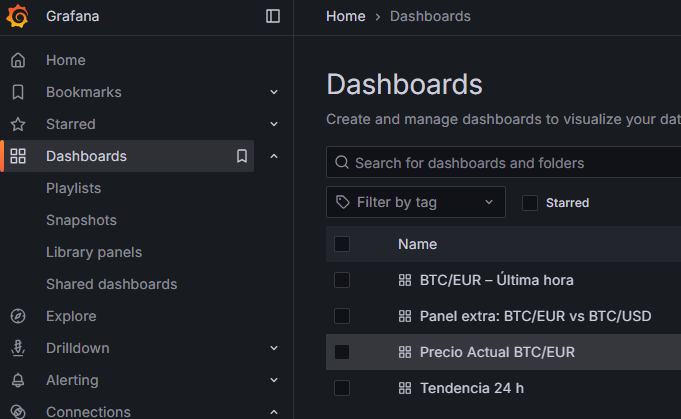

# Tarea Evaluable 1 – Pila MING (Mosquitto, InfluxDB, Node-RED, Grafana)

---

## 1. Descripción

Este proyecto despliega una pila **MING** formada por:

- **Mosquitto** (broker MQTT)
- **InfluxDB 2.x** (base de datos de series temporales)
- **Node-RED** (orquestación e ingesta de datos)
- **Grafana** (visualización y cuadros de mando)

El flujo obtiene periódicamente el **precio de Bitcoin (BTC)** desde la API pública de **CoinGecko**, lo almacena en InfluxDB y lo muestra en un dashboard de Grafana.

---

## 2. Requisitos previos

- Docker + Docker Compose instalados.
- Acceso a Internet.
- Navegador web moderno.

---

## 3. Variables de entorno (.env)

En la raíz del proyecto existe un fichero `.env` con las variables clave:

```env
# InfluxDB
INFLUXDB_ORG=mbp_org
INFLUXDB_BUCKET=crypto_data
INFLUXDB_ADMIN_USER=admin
INFLUXDB_ADMIN_PASSWORD=admin123
INFLUXDB_TOKEN=REEMPLAZAR_POR_TOKEN

# Grafana
GRAFANA_ADMIN_USER=admin
GRAFANA_ADMIN_PASSWORD=admin123

# Zona horaria
TZ=Europe/Madrid
```

---

## 4. Cómo levantar el stack

1. Clonar el repositorio:

```
git clone https://github.com/blesa03/sbd-te1-mbp.git
cd sbd-te1-mbp
```

2. Crear/editar el fichero `.env` con los valores apropiados

3. Levantar la pila:

```
docker compose up -d
```

4. Comprobar que los contenedores están en marcha:

```
docker ps
```

Deben aparecer al menos los contenedores:ç
- mosquito
- nodered
- influxdb
- grafana

---

## 5. Endpoints y credenciales por defecto

### 5.1 InfluxDB

- URL: *http://localhost:8086*
- Org: *mbp_org*
- Bucket principal: *crypto_data*
- Usuario admin: *admin* (configurable en .env)
- Password admin: *admin123* (configurable en .env)
- Autenticación: ***token*** (INFLUXDB_TOKEN del .env)

### 5.2 Node-RED

- URL: *http://localhost:1880*
- En esta práctica no se ha configurado autenticación adicional

### 5.3 Grafana

- URL: *http://localhost:3000*
- Usuario admin por defecto: *admin*
- Password inicial: *la indicada en .env (admin123)*

### 5.4 API de CoinGecko

Node-REDD llama internamente al endpoint:

```
https://api.coingecko.com/api/v3/simple/price?ids=bitcoin&vs_currencies=eur,usd&include_24hr_change=true

```

No requiere credenciales.

---

## 6. Dashboard de Grafana

Una vez configurado el **data source de InfluxDB** en Grafana, el dashboard incluye, como mínimo:

1. **Precio actual BTC/EUR** (Gauge/Stat).
2. **Gráfica BTC/EUR última hora** (Time series).
3. **Tendencia 24h BTC/EUR** (Stat con porcentaje).
4. **Comparativa BTC/EUR vs BTC/USD** (Time series).



---